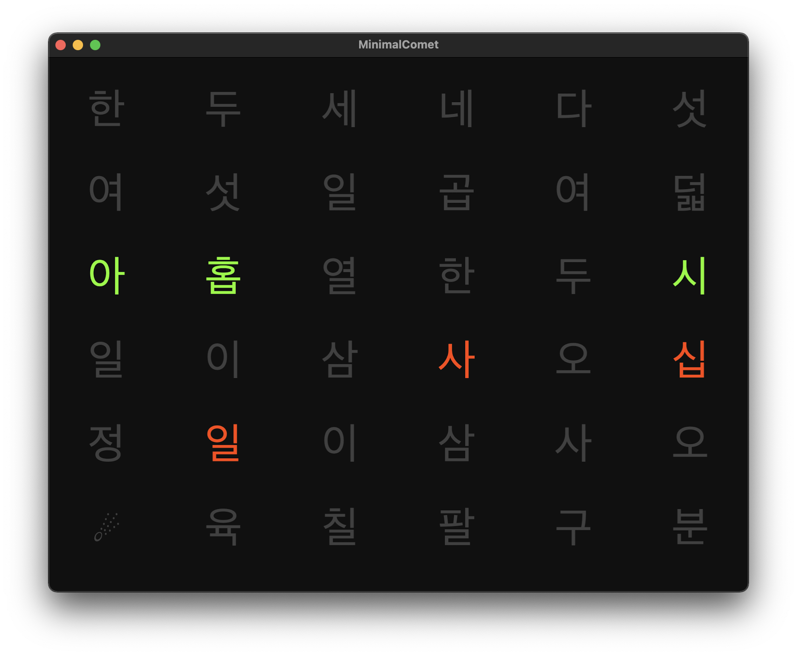
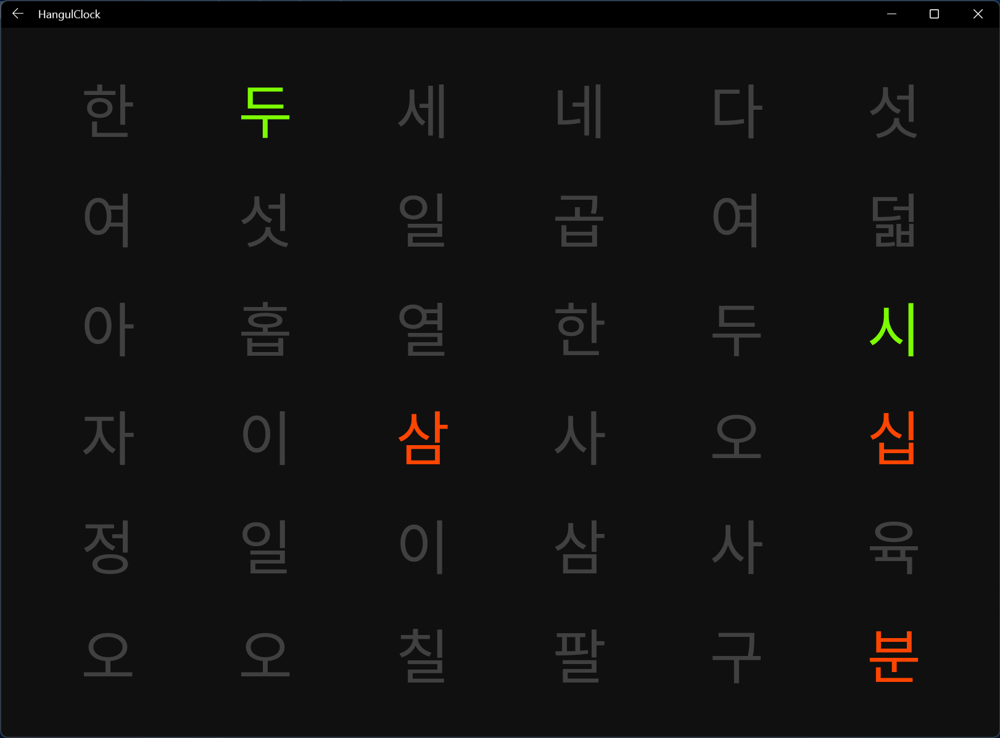

# Hangul Clock



This is a Korean word clock inspired by several craft projects including:

* https://github.com/dsa28s/windows-hangul-clock
* https://hangulclock.today/
* https://www.instructables.com/Korean-Clock-HA-Yong-Son/

I have taken 2 C# approaches to creating this experience, and both use the same [.NET MAUI](https://github.com/dotnet/maui) library to render native apps for Android, iOS, macOS, and Windows. 

## Comet

[Getting Started with Comet](https://dev.to/davidortinau/comet-development-on-macos-1o38)

[Comet](https://github.com/dotnet/comet) is an simple, C# framework for building [.NET MAUI](https://github.com/dotnet/maui) apps that run on Android, iOS, macOS, and Windows. Comet manages state in the style of Model-View-Update (MVU) which means the timer updates a state object, and the views react to the state changes. The Comet efficiently difs the changes needed to the UI and applies them.

```csharp
new Grid (
    columns: new object[] { "*", "*","*", "*","*", "*" },
    rows: new object[] { "*", "*","*", "*","*", "*" })
    {
        HangulText("한", row: 0, column: 0),
        HangulText("두", row: 0, column: 1),
        HangulText("세", row: 0, column: 2),
        HangulText("네", row: 0, column: 3),
        HangulText("다", row: 0, column: 4),
        HangulText("섯", row: 0, column: 5),
    ...
    }.Background("#101010")
```

```csharp
private void timer_Handler(object sender, System.Timers.ElapsedEventArgs e)
{
    Now.Value = DateTime.Now;
}
```

The state object `Now` will then update everywhere it's used. and Comet will update accordingly. My method `HangulText` that generates the `Text` controls, uses `Now` and helper methods to set the `Color` and `Opacity`. Those methods are re-eveluated when state is "updated".

```csharp
Text HangulText(Binding<string> val, int row, int column)
{
    var t = new Text(val)
        .VerticalTextAlignment(TextAlignment.Center)
        .HorizontalTextAlignment(TextAlignment.Center)
        .Frame(height: 64, width: 64)
        .FontSize(64)
        .Color(()=>GetColor(Now, val, row, column))
        .Opacity(()=>GetOpacity(Now, val, row, column));
    t.Cell(row, column);
    return t;
}
```

## Maui.Markup

.NET MAUI traditionally favors writing UI in XAML, and XML based markup language that provides separation between UI and logic. By using the .NET MAUI Community Toolkit's [Maui.Markup](https://github.com/CommunityToolkit/Maui.Markup) helpers, we can remove the complexity of XAML and stick with C# alone. 

```csharp
new Grid { 
    BackgroundColor = Color.FromHex("#101010"),
    Children = {
        (tileGrid = new Grid {
            RowDefinitions = Rows.Define (
                (Row.First	, Star),
                (Row.Second , Star),
                (Row.Third  , Star),
                (Row.Fourth , Star),
                (Row.Fifth	, Star),
                (Row.Sixth	, Star)
            ),
    
            ColumnDefinitions = Columns.Define (
                (Column.First	, Star),
                (Column.Second , Star),
                (Column.Third  , Star),
                (Column.Fourth , Star),
                (Column.Fifth	, Star),
                (Column.Sixth	, Star)
            ),
    
            Children = {
                // Row 1
                new TitleLabel{ Text = "한"}.Row(Row.First),
                new TitleLabel{ Text = "두"}.Row(Row.First).Column(Column.Second),
                new TitleLabel{ Text = "세"}.Row(Row.First).Column(Column.Third),
                new TitleLabel{ Text = "네"}.Row(Row.First).Column(Column.Fourth),
                new TitleLabel{ Text = "다"}.Row(Row.First).Column(Column.Fifth),
                new TitleLabel{ Text = "섯"}.Row(Row.First).Column(Column.Sixth),
            ...
            }
        })
    }
}
```

.NET MAUI uses Model-View-ViewModel (MVVM) with databinding, or event driven imperative state updates. In this example I'm using imperative. With each timer tick, I reset the grid and update the views based on preset models.

```csharp
private void timer_Handler(object sender, System.Timers.ElapsedEventArgs e)
{
    ResetGrid();
    UpdateGrid();
}

private void UpdateGrid()
{
    var d = DateTime.Now;

    var hourModel = HoursMap[d.Hour % 12];
    int cnt = tileGrid.Children.Where(c => {
        foreach(var t in hourModel.Tiles)
        {
            if((tileGrid.GetRow(c) == t.Y && tileGrid.GetColumn(c) == t.X) || ((Label)c).Text == "시")
            {
                ((Label)c).Opacity = 1;
                ((Label)c).TextColor = Colors.LawnGreen;
                return true;
            }
                
        }
        return false;
    }).Count();

    var minuteModel = MinutesMap[d.Minute];
    int cnt2 = tileGrid.Children.Where(c => {
        foreach (var t in minuteModel.Tiles)
        {
            if ((tileGrid.GetRow(c) == t.Y && tileGrid.GetColumn(c) == t.X) || ((Label)c).Text == "분")
            {
                ((Label)c).Opacity = 1;
                ((Label)c).TextColor = Colors.OrangeRed;
                return true;
            }

        }
        return false;
    }).Count();
}

private void ResetGrid()
{
    foreach(var l in tileGrid.Children)
    {
        ((Label)l).Opacity = 0.2;
        ((Label)l).TextColor = Colors.White;
    }
}
```



